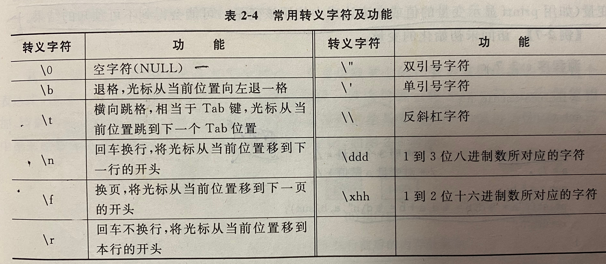
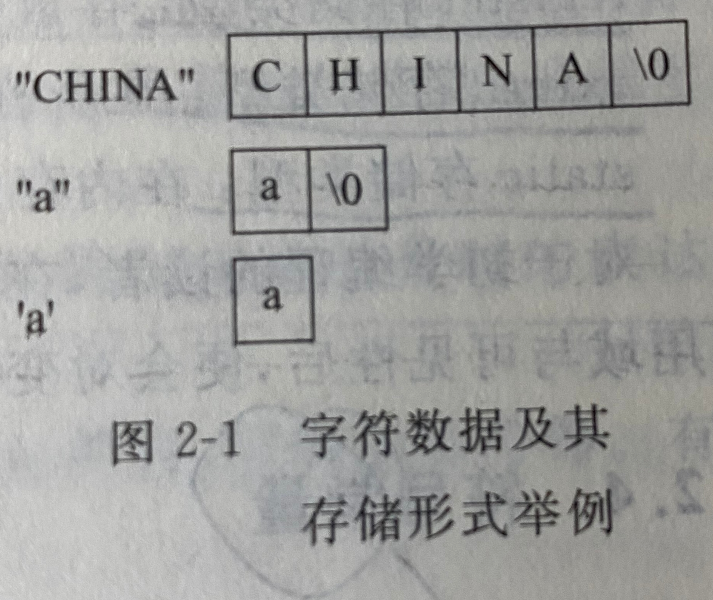
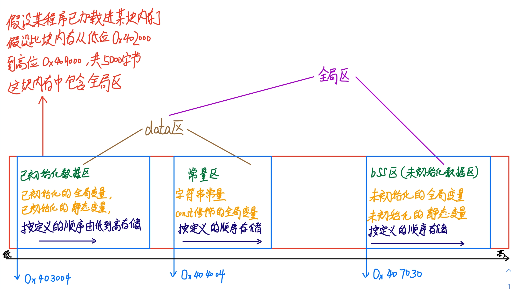
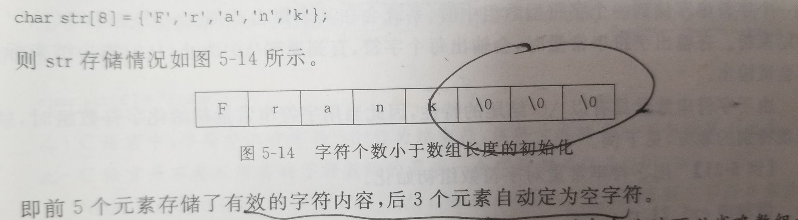
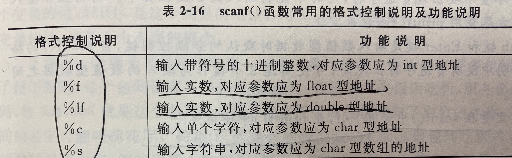
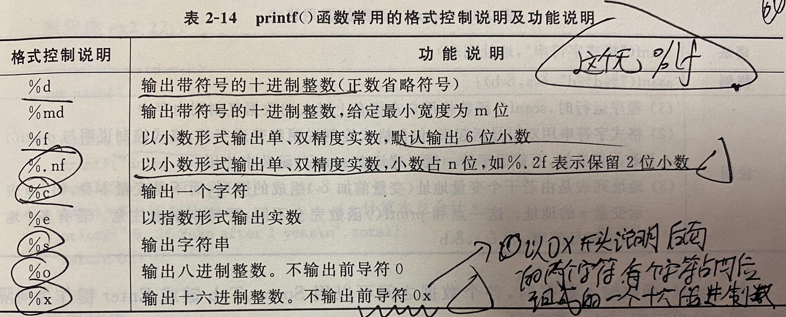
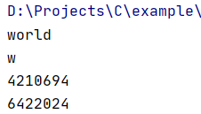
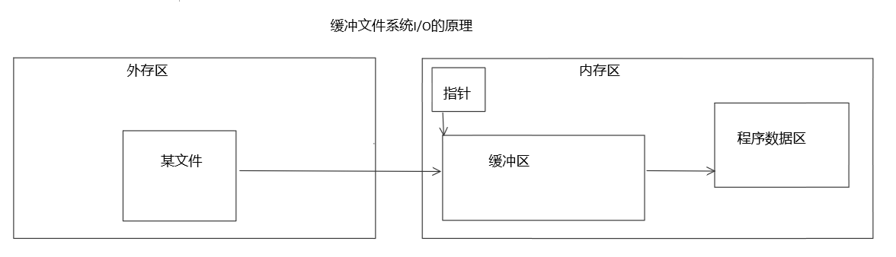
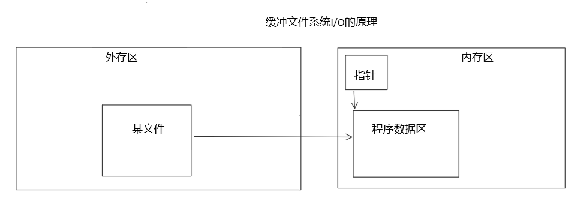

# 考纲分析

### 20年考纲:

1. 顺序、选择及循环程序设计：内容包括数据的表现形式及其运算、语句、数据的输入输出、选择结构和条件判断、关系运算符和关系表达式、逻辑运算符和逻辑表达、条件运算符和条件表达式、多分支选择结构、循环的实现等。 

2. 数组：内容包括一维和二维数组的定义和引用、字符数组的定义、输入输出及处理函数等。

3. 基于函数的模块化程序设计：主要包括函数的定义、调用、对被调用函数的声明和函数原型、嵌套调用、递归调用、数组作为函数参数的使用、局部变量和全局变量、变量的存储方式和生存期、变量的声明和定义、内部函数和外部函数等。

4. 指针：内容包括指针变量的定义、引用、作为函数参数的使用、通过指针引用数组、数组元素的指针、指针的运算、用数组名作函数参数、通过指针引用多维数组、通过指针引用字符串、字符指针作函数参数、指向函数的指针、返回指针值的函数、指针数组和多重指针等。

5. 自定义数据类型：包括定义和使用结构体变量、使用结构体数组、结构体指针、用指针处理链表、使用枚举类型、用typedef声明新类型名等。

6. 文件的输入输出：内容包括打开与关闭文件、顺序读写数据文件、随机读写数据文件、文件读写的出错检测等。

### 21年考纲：

​	程序设计基础：逻辑与数学运算，分支循环，过程调用(递归)，字符串操作，文件操作等

##### 	结论是，C语言部分大概率会跟20年考纲内容一样，重点通过20年考纲复习即可


# 前言和C语言基础

### 1.前言

##### 1.什么是C语言

​	C语言是面向过程的结构化语言

##### 2.C语言运行过程(最后总结)

1. 预处理， 展开头文件/宏替换/去掉注释/条件编译           （test.i main .i）
2. 编译，   检查语法，生成汇编                           （ test.s  main .s）
3. 汇编，  汇编代码转换机器码                             (test.o main.o)
4. 链接   链接到一起生成可执行程序                       a.out
5. 可执行文件                                                             a.c

##### 3.结构化程序设计

​	设计思想：自顶向下，逐步求精

##### 4.算法（详见数据结构笔记）

​	五个特征：有、确、可、出、入

​	三个结构：顺序结构、选择结构、循环结构

​	算法描述：详见数据结构

### 2.基本概念

##### 1.C语言要素


##### 


# 1.编译预处理

### 1.概要

​	在编译器对源程序**编译前**，首先由预处理器对程序文本进行预处理。

​	预处理提供了**不同的编译预处理指令，用来完成不同的预处理功能**

​	编译预处理指令实际上不是C语言的一部分，只是用来扩充C程序设计的环境，加#、无分号、独占一行，可以出现在程序的任意位置。

### 2.优点

​	使程序更简洁、易读，还可以提高程序的运行效率。

### 3.分类

​	1.宏定义

​		1.1带参数的宏
​		1.2无参数的宏

​	2.文件包含

​	3.条件编译

### 4.详解

##### 1.宏定义

编译预处理指令：#define

用法：

```c
//1.1无参数的宏，更好的替代是使用const在类型说明语句中进行修饰？
语法：#define 宏名 字符串
例如：#define PI 31.415926
    
//1.2带参数的宏
语法：#define 宏名(形参表) 字符串
例如：#define MULT(x,y) x*y
或：#define Min(a , b) (a < b ? a : b)
```

注意：

​	1.无参数的宏定义与变量定义不同，它只做字符替换，**不分配内存空间**

​	2.#define指令的含义是在**编译前**进行字符替换，**不进行语法检查**，到编译时才进行检查

​	3.无参数的宏定义一般使用大写

​	4.一般把程序中**反复使用的运算表达式和简单函数**定义为带参数的宏，这样可以使程序更简洁

带参数的宏和带参数的函数的区别：

​	贴图p201

##### 2.文件包含

​	1.指令：#include，作用是将另一个源文件嵌入到当前源文件中该点处

​	2.两种书写方式

```C++
#include<文件名>//按标准方式搜索要嵌入的文件，该文件位于编译环境的include子目录下，一般使用系统提供的标准文件时采用这个方式
#include“文件名”//表示首先在当前目录下搜索要嵌入的文件，如果没有，再按照标准方式搜索，一般自己编写的文件采用这个方式
```

​	3.可以嵌套使用（但是要防止多次重复包含同一个头文件）

##### 3.条件编译

​	1.作用：限定程序中某些内容需要满足一定条件的情况下才可以参与编译。

​	2.p202三种方式，建议背下来，且编程试一试


# 2.词法记号（最小的词法单元）

### 		1.保留字（关键字）

​		定义：是C预先声明的单词

### 		2.标识符

​		定义：是程序员定义的单词，它命名程序正文中的一些实体，如函数名，变量名，类名，对象名

​		组成：**字母、下划线**、数字（前两个是可以开头的标识符，但是下划线最好别用来开头，可能跟系统的名字起冲突）

​		标识符的作用于和可见性

### 		3.分隔符

​		定义：用于分隔各个词法记号或程序正文

​		包括：，：；（）{}

### 4.数据类型

*与**数据结构**的关系*

> int char float double 这些是 **数据类型** ，类比作**原子**，他们间的不同就是元素种类的不同，只涉及自身的不同，比如两种原子内的质子中子数不同，是一种内在属性。
> 链表 队列 堆栈 树 这些是**数据结构**，类比作**分子**，他们间描述的是数据间的关系，就如同分子描述了原子的组合方式


##### 	1.起别名typedef

​	1.给数据类型起别名：***typedef*** 已有类型名 新类型名**表**；（由此可见可以起多个别名）

​	2.引申：给变量起别名，详见[&运算符](#9.*运算符和&运算符)

##### 					2.分类：

​	1.基本数据类型（基本数据类型是C编译系统内置的，共12种基本数据类型，主要分为布尔类型，整型和实型三种）

​		1.bool （c99之前没有布尔类型，c99开始c语言提供了bool变量类型来定义布尔变量）

​		2.char 1

​		3.int 4

​		4.float

​		5.double 8

​		6.long、short、signed、unsigned称为修饰符

​	2.自定义数据类型（自定义的数据类型是程序员自己定义的）

​		分类：

​		1.[数组类型](#1.数组和字符串)

​		2.字符串类型

​		3.结构类型 struct  

​		4.枚举类型 enum

​			1.枚举元素按常量处理

​			2.枚举元素具有默认值 0、1、2…..

​			3.声明时可以定义元素的值

​			4.枚举值可以进行关系运算

​		5.联合类型 union

##### 		3.数据类型的转换

自动类型转换

强制类型转换

​	只是在当前运算中**临时改变**数据的类型，并没有改变其真正的类型


### 5.变量和常量

（每种类型的数据都有常量和变量之分）

##### 1.常量

​	定义：程序运行过程中其值始终不可改变的量

​	定义的三种方式：

​		1.符号常量： #define为宏定义命令：如***#define PI 20.1***	根据值自动设置数据类型

​		2.const修饰变量：修饰此变量的值不变，如***const int a =0;***	本质还是变量，只不过值不能更改，所以**有地址**

​		3.直接表示的常量

​		直接表示的常量的分类：

​			1.布尔常量

​			2.整型常量

​				整型常量的表现形式：

​					十进制：不可以0开头

​					八进制：0开头

​					十六进制：0x开头

​				后缀L（或l）表示长整型；U（或u）表示无符号型

​			3.实型常量（即浮点型,**默认double**，后缀加F f可使其成为float）

​				一般形式 如12.5，-12.5

​				指数形式 如0.345E+2表示0.345*10的2次方

​			4.字符常量

​				2.1可见字符常量 如：'a'，'1'，'%' 等

​				2.2不可见字符常量（转义字符）

​					加斜杠后的字符转换成另外的含义，一般是不能直接显示的，而是起一些特别的控制作用，又称转义字符

​					

​			5.字符串常量（跟字符常量在内存中的存放形式的区别）

​				

​				特殊！本质上是一个char类型的数组！所以有地址，只不过最后一个字节是"\0"，且**此字符串常量表示该数组的首地址**。所以字符串常量经常赋值给一个指向常量的指针。指向[字符串变量](#1.数组和字符串)

##### 2.变量

变量的声明就是定义，但是外部变量例外。变量的**定义**时发生**赋值**，我们称为**初始化**，可以不在定义时赋值，但是使用这个变量前必须初始化

给变量**起别名**（也就是“**引用**”）：

[&详解](#8.*运算符和&运算符)

数据类型 &别名 = 原名。如int a = 0;  int &b = a;

变量的定义：

```c
static extern int a;//即这是一个静态的、全局的、int型变量
```

​	分类：

​		变量的作用域（不写默认局部）

​			全局变量（外部变量）extern

​			局部变量

​		数据类型

​			所有类型	

​		变量的存储类型 决定了变量的存储方式（不写默认auto）

​			auto 采用堆栈方式分配内存空间，属于暂时性存储，其存储空间可以被若干变量多次覆盖使用，auto一般省略

​			register 存放在通用的寄存器，很少使用

​			extern 在所有函数和程序段中都可引用	

​			[static](#1.静态生存期) 在内存中是以固定地址存放的，在整个程序运行期间都有效

> ​						从 C++ 17 开始，auto 关键字不再是 C++ 存储类说明符，而是自动推断类型，且 register 关键字被弃用。

##### 3.变量的生存期

定义：

​		变量从诞生到消失的时间段称为对象的生存期，实际就是变量占用内存的时间。

###### 	1.静态生存期

​		定义：

​			如果对象的生存期与程序的运行期相同，则称它具有静态生存期。 

​		声明：

​			1.隐式：

​				在***命名空间作用域***中声明的对象都是具有静态生存期的。

​			2.显式：

​				在函数内部的***局部作用域***声明具有静态生存期的对象，需要使用static。

​		分类：***静态变量***，***静态对象***

​		细节：

​			声明基本类型静态生存期变量，会被初始化为0；声明动态生存期变量，不指定初值意味着初值不确定。

​		关键字：

​			static

​			如：	static in a;

​		局部作用域中静态变量的特点是：

​			它不会随着每次函数调用而产生一个副本，也不会随着函数返回而失效。

###### 	2.动态生存期

​		定义：

​			除了以上两种情况，其余对象都具有动态生存期。

​	各种关系：

​		假设源程序由好几个源文件构成

​			全局变量（外部变量）：

​				具有命名空间作用域的变量

​				本身是静态存储的方式，作用域是整个源程序，也就是各个源文件。

​				注：如果在一个文件中使用***extern***关键字来声明另一个文件中存在的全局变量，那么这个文件可以使用这个数据

​			局部变量（内部变量）：

​				具有局部作用域的变量

​				局部变量的作用域是定义该变量的函数或定义该变量的复合语句。

​			静态变量

​				具有静态生存期的变量。

​				生存期是程序的运行期。

​			动态变量（一般简称为变量）

​				具有动态生存期的变量。

​				生存期是从定义开始到所在块结束

​				**注：不用static修饰的成员对象，其生存期都与它们所属对象的生存期保持一致**

​			静态全局变量：

​				全局变量加static，作用域也是整个源程序，但是该变量被限制只在这个源文件中可用

​				如果在一个文件中使用extern关键字来声明另一个文件中存在的静态全局变量，这个文件也**不能够使用**这个数据

​			静态局部变量：

​			动态全局变量（一般简称为全局变量）

​			动态局部变量（一般简称为局部变量）

| 变量         | 作用域             | 生存期     | 存储类型       | 存储关键字     | 存储细分区 | 注                                           |
| ------------ | ------------------ | :--------- | -------------- | -------------- | ---------- | -------------------------------------------- |
| 全局变量     | 全局命名空间作用域 | 静态生存期 | 静态存储       | extern         | 全局区     | 也称外部对象                                 |
| 静态变量     | 看局部还是全局     | 静态生存期 | 静态存储       | static         | 全局区     | 加static的对象                               |
| 静态全局变量 | 命名空间作用域     | 静态生存期 | 静态存储       | static、extern | 全局区     | 被限制在所在源文件，改变了全局对象的作用域   |
| 静态局部变量 | 局部作用域         | 静态生存期 | 静态存储       | static         | 全局区     | 改变了局部对象的生存期                       |
| 局部变量     | 局部作用域         | 动态生存期 | 动态存储       | 无             | 栈区       | 也称内部对象，包括函数形参（函数原型作用域） |
| 动态变量     |                    | 动态生存期 | 动态存储malloc |                | 堆区       | 在程序运行中动态申请内存的对象，由程序员控制 |


##### 4.程序执行期间的内存分区

​	分区意义：不同区域存放数据，赋予不同的生存期，使编程更加灵活。

​	编译、连接后生成.exe可执行二进制程序，此时程序未运行，（**代码区**+**全局区**）包含在程序中，程序**存储在外存中**。

​	当开始点击运行程序，代码区+全局区就被操作系统分配内存，具有静态生存期（即整个程序的生命周期），直到程序停止运行，操作系统才为其释放内存。当需要使用栈区或堆区的数据时，由操作系统或程序员为其分配内存，不需要时由操作系统或程序员为其释放内存。

###### 1.代码区

​		具有静态生存期，由操作系统进行管理

​		特点是：共享和只读

###### 2.全局区

​		具有静态生存期，每次运行程序都由操作系统为全局区分配内存，所以程序运行时全局区在整个内存的位置并不固定，在程序结束后由操作系统释放内存。

------



------

​		

​		存储**全局变量、静态变量和常量**（字符串常量和const修饰的全局变量）

​		全局区代码演示：


###### 3.栈区

​		具有动态生存期

​		由编译器自动分配和释放，编译器控制生存期，存放函数的参数值，局部变量，局部常量等

###### 4.堆区

​		由程序员分配和释放，程序员控制生存期，若程序员不释放，程序结束时由操作系统释放

​		主要利用***new***在堆区开放内存


### 	6.运算符和表达式

#### 	1.算数运算符和算数表达式

​	+	-	*	/	%

#### 	2.赋值运算符和赋值表达式

​	=	+=	-=	*=	/=	%=

#### 	3.自增、自减运算符

​	++	--

#### 	4.条件运算符

​	(a>b)?a:b

#### 	5.逻辑运算符和逻辑表达式

##### 		1.关系运算符

​			——关系表达式（即关系运算的程序表示）——关系运算符  >  <  >=  <=

​			是二元运算符（二目运算符）

​			可对整型、浮点型、字符（实际为对ASCII码的比较）进行比较，也可以是比较混合类型的操作数。

​			关系运算的结果为0（不成立）或1（成立）

###### 			1.1判等运算符

​			属于关系运算——关系运算符 ==   !=。

```c
#include <stdio.h>
int main() {
    double d1 = 0.3;
    double d2 = 0.1;
    double d3 = 0.2;
    printf("%d\n",d1==(d2+d3));
    return 0;
}
```

​			运行结果是0，也就是不相等。**为什么呢？**

​			**此处要注意对浮点数的判等运算，因为浮点数的存储存在误差。**所以应该避免对两个浮点数进行直接的判等运算，而是采用判断两者的差的绝对值是否小于某个很小的数来实现。改进如下：

```c
printf("%d\n",fabs(d2+d3-d1)<1e-6);//将上边的输出语句改成这条，fabs是求浮点数绝对值的函数，存在于math.h的头文件中。
```

##### 			2.逻辑运算符

​			——逻辑运算表达式——逻辑运算符 !  && ||

​			&& ||是二元运算符（二目运算符），!是一元运算符（单目运算符）

​			可以用来实现多个关系运算的连接

​			逻辑运算的结果为0（假）或1（真）

​			**注意：C语言把零当作“假”看待，把非零数据当作“真”看待**

###### 			2.1短路运算符

​			&& 和||也称为短路运算符，有时只执行&&或||前的内容就可得出最后结果，那么就不会继续计算下去。

#### 	6.sizeof运算符

​	可以计算常量，变量，数据类型，表达式的所占字节数

#### 7.逗号运算符，有时用于for语句中

​	将几个表达式通过逗号连接起来成为一个表达式，构成逗号表达式

```c
int sum = 0;
for(int i = 1;i<=100;i++){
	sum+=i;
}

//如需在for语句中对i和sum同时进行初始化，则改写如下:
for(int i = 1, int sum =0;i<=100;i++){
	sum+=i;
}
```

#### 	8.位运算符

一般不考，先放在这，p229

#### 9.*运算符和&运算符

***和&作为一元运算符和二元运算符时有不同意义。**

作一元运算符时，*称为指针运算符，也称为解析（dereference），表示获取指针所指向的变量的值。

作二元运算符时，*定义为一个指针，仅起标识作用，标识这是一个指针。此时把它想象成与int、double等价的关键字。

作一元运算符时，&称为取地址运算符，用来得到一个对象的地址，例如，使用&i就可以得到变量i的存储单元地址。

做二元运算符时，&起别名，仅起标识作用，标识这是一个引用。而且引用必须初始化，使他指向一个已存在的对象，并且不可以再改为指向其他对象，很像使用***const***声明为常变量

```c++
int *ptr;//定义时仅表示定义了一个int类型的指针。二元运算符
cout<<*ptr<<endl;//在执行语句中表示输出指针ptr1所指向的内容。一元运算符

int a = 0;
int &rf = a;//初始化一个int型的引用rf指向a，相当于给变量a起别名。二元运算符
cout<<rf<<endl;//输出0
cout<<&rf<<endl;//输出地址0x61fdf4。一元运算符
cout<<&a<<endl;//输出地址0x61fdf4。一元运算符
```


#### 	8.运算符的优先级

p300


# 3.自定义数据类型分类详解

### 1.数组和字符串

[数组与指针的联系](#6.一维数组与指针)

##### 1.数组的初始化

​	数组元素在内存中是顺序、连续存储的。

​	数组的初始化就是在声明数组时给部分或全部元素赋初值。

​	**数组名**就是该数组存储的**首地址**，但是不能被赋值，所以数组名是指针常量。

```c++
//一维数组的初始化,若不初始化，默认全部元素为0
int a[3]={1,1,3};//一般方式，且中括号内不可以是变量。
int b[]={1,2,4,5};//可省
float c[5]={1.0 , 2.0};//未赋初值的数默认值为0
int d[10];//系统默认赋值所有元素都为0

//二维数组的初始化
int d[2][3]={1,1,1,2,2,2};//一般方式
int e[][3]={1,1,1,2,2,2};//可省一个
int f[2][3]={{1,1,1},{2,2,2}};

const int g[5]={1,1};//初始化后皆不可改变
```

​	可用***static***、***const***修饰

​	可以用循环存取数组。

##### 2.一维数组的增、删、查、排序、统计

###### 1.增加

​	因为数组是在一块连续内存上存储的，所以最简单的就是从最后一个数组元素开始增加即可，耗时少。但是如果是要从数组元素中间插入，那么需要把数组元素依次向后移动，腾出空位，然后插入。

###### 2.删除

​	先检查数组元素是否存在，若存在，执行删除操作；若不存在，报错。删除操作：将删除位置以后的所有数组元素向前移，覆盖被删除的元素。

###### 3.查找

​	顺序查找、二分查找等。各有优缺点

###### 4.排序

​	选择排序算法等

###### 5.统计

​	详见p132

##### 3.字符串

```c++
//字符串常量
const char *str = "abc";
"aaa"

//字符串变量,以下三种写法等同
char str[4] = "abc";//用字符串常量初始化字符数组，此时一定要预留1个长度来存储‘\0’,
char str[] = "abc";
char str[8] = {'a','b','c','\0'}
char str2[8]={'F','r','a','n','k'};//若最后存在多个“\0”，也表示此字符数组是字符串

//字符数组
char str2[5]={'F','r','a','n','k'};

```

​	

​	通过字符数组的方式操作字符串需要借助string.h头文件中的strlen、strcpy，strcat，strcmp等函数

**注意**：字符数组和字符串虽然看似差距不大，但是实际使用中如果一个字符数组最后一位没有"\0"，那么它就不是字符串，**无法进行字符串的操作**。也就是说，字符串属于特殊的字符数组。


### 2.结构体

一般写在main函数外边

##### 1.结构类型的声明、定义和初始化

```c
//学生地址结构类型的声明
struct Stu_Address{//学生家庭地址
	int zipcpde;//邮政编号
    char location[100];//详细地址
};

//学生结构类型的声明
struct Student{
    int id;
    char name[20];
    int age;
    struct Stu_Address address;//可嵌套
};

//起别名
//1.若结构类型未定义好，给结构类型struct Student起别名为STUDENT
typedef struct Student{
    int id;
    char name[20];
    int age;
    struct Stu_Address address;//可嵌套
}STUDENT;

//2.若结构类型已定义好，也可以再用typedef起别名
typedef struct Student STUDENT;
```

[typedef](#1.起别名typedef)

##### 2.结构变量的声明、定义和初始化

```c
struct Student stu1,stu2;//未起别名，结构变量的声明
STUDENT stu1,stu2;//已经起别名，声明结构变量

struct Student{
    int id;
    char name[20];
    int age;
    struct Stu_Address address;
}s1,s2;               //声明结构类型的同时声明结构变量

//结构变量的初始化
struct Student s1 = {001,"马揄扬",21,{370889,"青岛理工大学"}};
STUDENT s2 = {002,"虞书欣",21,{370889,"青岛理工大学"}};

//这样是不允许的，已经定义后不准再进行整体赋值操作，只能通过变量的成员进行操作
STUDENT s1;
s1={001,"马揄扬",21,{370889,"青岛理工大学"}};

//但是可以用一个变量给另一个变量赋值
STUDENT s1 = {001,"马揄扬",21,{370889,"青岛理工大学"}},s2;
s2=s1;
```

结构类型和结构变量是两个不同的概念，结构变量是实体，分配内存空间，可以对其进行赋值、存取和运算。而结构类型既不分配内存空间，也不可以对其进行赋值、存取和运算。是类型——变量的对应关系。

##### 3.结构变量的引用

```c
//操作结构变量成员的方式
s1.id = 003;
s1.address.zipcpde = 175336;
```

##### 4.结构数组的定义和引用

```c
struct Student stu[3] = {{001,"马揄扬",21,{370889,"青岛理工大学"}},{002,"虞书欣",21,{370889,"青岛理工大学"}}};
//操作结构变量成员的方式
stu[2].id = 003;
stu[2].name = "jennie";
...
```

##### 5.结构指针变量的定义和引用

###### 1.指向结构变量的指针

```c
STUDENT s1 = {001,"马揄扬",21,{370889,"青岛理工大学"}};
STUDENT *ptr = &s1;//因为这里不是数组名或函数名，不代表地址，要取地址.

//操作变量成员的方式
ptr->id = 002;
```

###### 2.指向结构数组的指针

```c
struct Student stu[2] = {{001,"马揄扬",21,{370889,"青岛理工大学"}},{002,"虞书欣",21,{370889,"青岛理工大学"}}};
STUDENT *ptr = stu;//数组名是首地址

//操作变量成员的方式
ptr->id = 004;
(ptr+1)->id = 005;
```

##### 6.结构指针变量作为函数参数

###### 1.传递结构变量

###### 2.传递结构变量成员

###### 3.传递结构指针

```c
//1.传值，因为要把全部成员一一传递，严重影响效率
//2.传值
//3.传地址，大大提高效率
```


### 3.共用体

##### 1.共用、共用变量的声明、定义和初始化

```c
//跟结构类似
typedef union Bus{
    int passengers;//载客量
    double load;//载重
}BUS;

BUS b1 = {0555};
BUS b2 = {0066,7000};//错误，只能初始化第一个成员
```

共用与结构的本质区别：每一个结构成员都有独立的内存，结构变量所占内存大小至少是所有成员空间大小之和；而共用体成员共享一段内存，共用变量所占内存大小等于其最大的一个成员的空间。如图：p225


##### 2.共用体的使用

**共用体通常用作结构体的内嵌成员**

```c
//对货车来说，载重量是其重要指标；对客车来说，载客量是其重要指标
BUS h,k;

//共用体只能存放最后一个选中的成员
h.load = 1000;
h.passengers = 10;//h.load会被覆盖

k.passengers = 30;
```

### 4.枚举

##### 1.枚举类型、枚举变量的声明、定义和初始化

还是跟结构体类似

```c
enum Weekday{Mon,Tue,Wen,Thu,Fri,Sat,Sun};//每个枚举常量代表一个整数值，默认从0开始，以此为0，1，2，3，4，5，6
typedef enum Weekday WEEKDAY;
WEEKDAY w;
```

##### 2.枚举类型的使用

```c
w = Mon;
//等同于
w = (WEEKDAY)0;
```


# 4.语句

以分号结尾的执行命令称为一条语句

# 5.数据的输入和输出

### 1.标准字符的输入输出函数getchar()和putchar()，字符串输入输出gets()和puts()

```c
char ch1;
ch1 = getchar();

char ch2='a';
putchar(ch2);

gets(str);
puts(str);
```

### 2.格式化输入输出函数scanf()和printf()






# 6.注释

单行//

多行/* */


# 7.指针详解

### 1.内存空间的访问方式

用来存放内存单元地址的变量类型称为指针类型。

### 2.指针变量的定义

```c++
int *ptr;//此处的*仅仅是定义ptr是个指针类型。定义了一个指向int类型数据的指针变量，名称是pty，用来存放int类型数据的地址。
```

### 3.指针的赋值

如果仅仅是定义了一个指针而未初始化，则由于具有动态生存期，所以会有一个随机地址，此时不能对其进行操作，因为若此指针指向了一个重要数据，肆意使用会造成严重的后果。**所以定义时最好进行初始化，实在不行可以先初始化为0。**

##### 1.定义指向常量的指针

​	指针的值可以改变，但是不能通过指针改变常量的值

##### 2.定义指针类型的常量

​	指针的值不可变，因为指针是常量；因为是常量，所以必须初始化。	

​	例如数组名，实际上就是一个不能被赋值的指针，称为指针常量

##### 3.void类型的指针（特殊）

​	一般只在指针所指向的数据类型不确定时使用。

```c++
int i = 0;
const int *p1 = &i;   //定义指向常量的指针
int * const p2 = &1;  //定义指针类型的常量
void *p3 = &i;        //void类型的指针可以存储任何类型的对象地址
cout<<*(int *)p3<<endl;//输出0，表示先把指向void的指针类型变量p3转化为指向int类型的指针类型变量，再用*取出指向的int值。
cout<<*(int)p3<<endl;//若是写成这样，由于p3是指针类型的，强制转换成int类型的，再用*取值，很显然是错误的。
```


### 4.*和&的详解

***和&作为一元运算符和二元运算符时有不同意义。**

作一元运算符时，*称为指针运算符，也称为解析（dereference），表示获取指针所指向的变量的值。

作二元运算符时，*定义为一个指针，仅起标识作用，标识这是一个指针。此时把它想象成与int、double等价的关键字。

作一元运算符时，&称为取地址运算符，用来得到一个对象的地址，例如，使用&i就可以得到变量i的存储单元地址。

做二元运算符时，&起别名，仅起标识作用，标识这是一个引用。而且引用必须初始化，使他指向一个已存在的对象，并且不可以再改为指向其他对象，很像使用***const***声明为常变量

```c++
int *ptr;//定义时仅表示定义了一个int类型的指针。二元运算符
cout<<*ptr<<endl;//在执行语句中表示输出指针ptr1所指向的内容。一元运算符

int a = 0;
int &rf = a;//初始化一个int型的引用rf指向a，相当于给变量a起别名。二元运算符
cout<<rf<<endl;//输出0
cout<<&rf<<endl;//输出地址0x61fdf4。一元运算符
cout<<&a<<endl;//输出地址0x61fdf4。一元运算符
```

### 5.指针运算 

​	*（p1+n）等价于p1[n]，表示p1当前所指位置后**第n个数**的内容。与指向的数据的类型息息相关。此处可以联想数组名，不同的是数组名是指针常量。p1可以是指针常量，也可以是指针变量

​	指针变量可以和整数0进行比较，专用于表示空指针，也就是一个不指向任何有效地址的指针。


### 6.一维数组与指针

```c
int a[10];
int *ptr1;
int *ptr2;

ptr1 = a;//把a的首地址赋值给指针ptr1，或者说指针ptr1指向数组a的首地址。
ptr2 = &a[0];//因为数组a的首地址就是a的第一个元素的地址，所以这两种写法都可以，建议第一种写法，简单。


```

**数组名**就是该数组存储的**首地址**，但是不能被赋值，所以数组名是指针常量。**所以指针ptr1、ptr2和a还是有区别的**。


### 7.字符指针

```c
char *ptr = "hello world";//字符指针
int n = 6;//因为一个char占一个字节
ptr = ptr+n;
printf("%s\n",ptr);//此时不需要*，因为需要输出的是ptr指向的字符串。
printf("%c\n",*ptr);//输出单个字符时，需要用*。
printf("%d\n",ptr);//输出指针指向的地址
printf("%d\n",&ptr);//输出指针的地址
```

输出为：

注意：输出指针指向的字符串时，指针前不需要加*。	

### 8.指针数组

如果一个数组的每个元素都是指针类型，且每个元素都指向同一类型的数据，那么这个数组就是**指针数组**。

```c++
int *p[3] = 0;
int *ptr[3] = {"lalala","hello","world"};//指向每一个字符串常量的首地址。
```


### 9.指向指针的指针

```c
int *str[3] = {"lalala","hello","world"};
int **p[3] = 0;
for(int i = 0;i<4;i++){
    p = str+i;       //使p指向str[i]
    printf("%s",*p); //输出name[i]所指向的字符串的内容
}
```


# 8.函数

##### 		1.函数的声明和定义

```C++
double plus(double a,double b);//函数原型声明，一般写在main函数之前
double plus(double,double);//函数原型声明的简洁版
double plus(double a,double b){//函数的定义，括号内是形参
	return a+b;//返回值
}
```

##### 		2.函数的调用

​	普通调用

​	嵌套调用

​	递归调用

##### 		3.函数的参数传递

​	1.值传递	单向传递，只能实参传形参，不能形参传实参

​	2.**引用传递**	双向传递

##### 4.用指针作为函数参数 / 指针型函数 / 指向函数的指针

###### 	1.用指针作为函数参数

​	当传送大量数据时，只传递该数据块在内存中的首地址，就提高了很大的效率。

​	在习惯上，如果不需要通过指针改变指针所指向对象的内容，那么可以在参数表中，将该指针声明为指向常量的指针。

​	使用引用作为形参和使用指针作为形参可以达到同样的目的。

###### 	2.指针型函数

​	（一般用不到）

​	当一个函数的**返回值是指针类型**时，这个函数就是指针型函数。

###### 	3.指向函数的指针

​	（一般用不到）

​	实际上函数名就表示函数的代码在内存中的起始地址。

​	一旦函数指针指向了某个函数，它与函数名便有了相同的作用。

​	[typedef](#1.起别名typedef)

```c++
//1.用指针作为函数参数
int plus1(int *a,int *b){
...
}

//2.指针型函数
int *plus2(int a,int b){
	return 指针;
}
//3.指向函数的指针
int (*ptr) (int a,int b);//声明一个函数指针，函数的返回类型是int，指针的名称是ptr，形参表指明所指函数的形参表

typedef int(*Ptr) (int a,int b);//声明Ptr为“有两个int类型形参，返回类型为int的函数指针”类型的别名。
Ptr ptr1;//声明变量
ptr1=plus1;//函数指针名=函数名
```


# 8.基本控制结构

> 顺序、选择和循环是基本的，顺序和循环是最基本的（软工）

### 1.选择结构（分支结构）

1.if、if—else、if—else if—else if—else、if的复合语句（在一组语句外加大括号，强制编译器将其作为一条语句）、if的嵌套

2.switch—case(break)—(default)：开关语句

default中的break语句可有可无。

break：结束本层循环

**随机数函数**

### 2.循环结构

##### 1.while语句

###### 	1.计数循环

​		执行前需准确知道解决问题所需要的循环次数

###### 	2.标记控制循环

​	若事先无法确定循环次数，可以使用标记控制循环

```c
while(score>=0){
	sum+=score;
}
则输入 68 98 52 87 -2,即可控制循环停止
```

###### 	3.条件循环

​	while括号内使用逻辑表达式

###### 	4.[文件](#9.文件)结束控制循环

​	EOF被视为文件结束的标志，是一个常量，定义在头文件stdio.h中，数值一般为-1

​	EOF——>使用ctrl+Z生成一个EOF，告诉系统输入结束了，再按enter继续执行

​	跟[2.标记控制循环](#2.标记控制循环)有点像。

##### 2.do—while语句

​	至少执行一次

##### 3.for语句

​	功能最强大，使用最广泛

##### 4.退出循环

###### 1.break语句

​	跳出所在循环体，当break出现在**嵌套循环**的内层循环时，**只能跳出内层循环**

​	只能用于循环语句和switch—case语句

###### 2.continue语句

​	结束本次循环，进行下一次循环

###### 3.go to语句

​	称为无条件转移语句，即goto语句的作用是无条件地转去执行**同一个函数**中的另一条语句。

​	如果想要直接**跳出外层循环**，则需要**对外层循环添加标记**，使用goto语句

```c
int	main(){
    printf("开始1");
    int i;
    loop:                //标记位置
    printf("开始2");
    for(i= 0;i<10;i++){
        int b = 0;
        b++;
    }else{
        goto loop       //跳出，执行loop标记位置
    }
}
```

​	不能不用，但是又不提倡多用，因此**尽量少用**

# 9.文件

### 1.文件概述

##### 1.文件定义

文件是信息的集合，是信息形成的数据流

##### 2.文件分类

根据文件中数据的存储形式，分为文本文件（ASCII文件）和二进制文件

##### 3.C语言对文件操作的两种方式

###### 1.缓冲文件系统I/O（标准I/O）

原理：



标准I/O提供三种类型的缓冲区：全缓冲、行缓冲和不带缓冲

###### 2.不缓冲文件系统I/O（低级磁盘I/O）

 原理：



##### 4.文件类型的指针

```c
FILE *fp;
```

每个文件对应一个**唯一**的文件类型的指针变量，实际上指针指向的是**文件缓冲区的首地址。**

### 2.文件的打开和关闭

##### 1.文件打开函数

```c
FILE *fopen( const char * filename, const char * mode );//使用 fopen( ) 函数来创建一个新的文件或者打开一个已有的文件，若创建或打开成功，则为打开的文件创建一个缓冲区，并返回缓冲区首地址；若失败，返回NULL。
```


| r    | 打开一个已有的文本文件，允许读取文件。                       |
| ---- | ------------------------------------------------------------ |
| w    | 打开一个文本文件，允许写入文件。如果文件不存在，则会创建一个新文件。在这里，您的程序会从文件的开头写入内容。如果文件存在，则该会被截断为零长度，重新写入。 |
| a    | 打开一个文本文件，以追加模式写入文件。如果文件不存在，则会创建一个新文件。在这里，您的程序会在已有的文件内容中追加内容。 |
| r+   | 打开一个文本文件，允许读写文件。                             |
| w+   | 打开一个文本文件，允许读写文件。如果文件已存在，则文件会被截断为零长度，如果文件不存在，则会创建一个新文件。 |
| a+   | 打开一个文本文件，允许读写文件。如果文件不存在，则会创建一个新文件。读取会从文件的开头开始，写入则只能是追加模式。 |

如果处理的是二进制文件，则需使用下面的访问模式来取代上面的访问模式：

```
"rb", "wb", "ab", "rb+", "wb+", "ab+"
```

##### 2.文件关闭函数

```c
int fclose( FILE *fp );
```

如果成功关闭文件，**fclose( )** 函数返回零，如果关闭文件时发生错误，函数返回 **EOF（-1）**。这个函数实际上，会清空缓冲区中的数据，关闭文件，并释放用于该文件的所有内存。**EOF** 是一个定义在头文件 **stdio.h** 中的常量。

```c
FILE *fp;
if((fp = fopen("D:\\Projects\\C\\example\\lalala.txt","r"))==NULL){
	printf("不能打开\n");
	exit(0);//需要加上stdlib.h的头文件，作用是关闭所有文件，终止程序的执行，返回操作系统，所以必须放在条件最后处执行
    printf("lalala");//如果加上这一句话，就会报错，因为exit会强制执行结束，这就话发不出来，程序会莫名终止
}
else{
	printf("打开了\n");
	fclose(fp);
}
```

建议：为了提高运行速度，建议使用完一个文件后立即关闭。

### 3.文件的顺序读写

打开文件后，需对文件进行读写等操作

C 标准库提供了各种函数来按字符或者以固定长度字符串的形式读写文件。基本有以下四种：

​	1.字符读写函数 fgetc()和fputc()

​	2.字符串读写函数 fgets()和fputs()

​	3.数据块读写函数 fread()和fwrite()      判断文件结束函数feof()

​	4.格式读写函数 fscanf()和fprintf()

注意：文件的读写跟fopen函数的第二个参数有莫大的关系！！


##### 1.字符读写函数 fgetc()和fputc()

主要用于文本文件的读写

```c
int fputc( int c, FILE *fp );//将一个字符写入文件指针所指向的文件的当前位置,若写入成功，返回该字符的ASCII码整数值，若失败，返回EOF，即-1
int fgets( const char *s, FILE *fp );//若写入成功，返回该字符的ASCII码整数值，若失败，返回EOF，即-1
```

```c
printf("输入一句话，#号结束\n");
char ch = getchar();
//char ch;//如果这样写，那么因为系统会自动初始化ch==0，写入时会多写入0的ASCII编码，也就是换行
while (ch!='#'){
    fputc(ch,fp);
	ch = getchar();
}

//更简洁的写法
char ch;
while ((ch = getchar())!='#'){
	fputc(ch,fp);
}
```

```c
char ch;
while ((ch =fgetc(fp))!=EOF){//每次循环执行读或写任务后，指针fp都会自动后移一个字节，以便下次读写。
	putchar(ch);
}
```

##### 2.字符串读写函数fgets()和fputs()

```c
int fputs( const char *s, FILE *fp );//若写入成功，返回0，若失败，返回EOF，即-1。字符串最后的'\0'并不写到文件中去，也不自动添加换行符'\n'
char *fgets( char *s, int n, FILE *fp );//从 fp 所指向的输入流中读取 n - 1 个字符。它会把读取的字符串存入s指向的内存区，串末自动添加'\0'。若读入成功，返回s首地址；若失败，返回NULL。s是一个字符内存区首地址指针
```

fgets函数：

1.若在未读满n-1个字符时提前遇到**换行符**，那么读取结束，在**换行符之后添加'\0'**组成字符串，存入s指向的内存区。

2.若在未读满n-1个字符时提前遇到**文件结束符EOF**，那么读取结束，把**EOF换成'\0'**组成字符串，存入s指向的内存区。

```c
char str[16];
fgets(str,16,fp);//得到16-1个字符和'\0',写入str指向的字符串中
printf("%s\n",str);
s = "lalala";
fputs(s,fp);
```

##### 3.数据块读写函数fread()和fwrite()

主要用于二进制文件的读写

> 在C语言中，文本文件可以用**EOF**和**feof()函数**作为文件结束标志，而二进制文件**只能使用feof()函数**来判断文件是否结束。

```c
int feof(FILE *fp);//遇到文件结束，函数返回1，否则返回0
int fwrite(void *buffer,int size,int n,FILE *fp);//fwrite()函数从程序数据库区buffer开始，将n项长度为size的字节数据写入到fp指向的缓冲区。若写入成功，返回实际写入的项数，否则返回小于等于0的数据。buffer为要输出的数据首地址，size为每个数据项的字节数，n为要写出的数据项的个数，fp为指向已打开文件的指针。
int fread(void *buffer,int size,int n,FILE *fp);//fread()函数从fp所指的文件中，读取n个长度为size的字节数据，保存到buffer所指向的内存缓存区中。若读取成功，返回实际读到的项数，否则返回小于等于0的数据。
```

