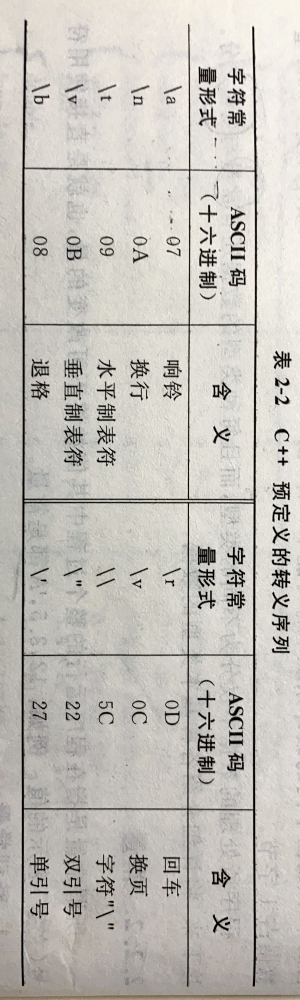

# 第1章 绪论

### 1.语言的发展

​	机器语言——>汇编语言——>高级语言
​		

### 2.面向对象特点

​		封装

​		继承

​		多态


### 3.信息的存储和表示

##### 	1.进制和进制的转换

​		R到十进制 

​		十到R进制

​		二、八、十六进制之间的转换

##### 	2.二进制数的编码表示

​		原码

​		反码

​		补码

##### 	3.定点数和浮点数

##### 	4.数的表示范围

##### 	5.非数值信息的表示


# 第2章 C++基础

### 1.C++语言的发展过程

​	B语言——>C语言（面向过程）——>C++语言（为了满足面向对象的程序设计，所以不是一个纯正的面向对象的语言）


### 2.C++完整程序过程

​	**编写**名为xxx.cpp的源文件——>编译系统**编译**生成名为xxx.obj的目标程序——>编译系统**连接**成名为xxx.exe的执行程序


### 3.C++主要特点:

​	尽量兼容C；

​	既支持面向过程的程序设计，又支持面向对象的程序设计


### 4.C++基本代码说明

```c++
#include<iostream>
using namespace std;

int main(){
    cout<<"hello world!"<<endl;
    return 0;
}
```

```c++
#include<iostream>
```

​	表示编译器在对程序进行预处理时，将文件iostream中的代码嵌入到程序中该指令所在的地方，其中：#include被称为预处理指令；iostream被称为头文件。（include详解[5.7.5.1](#1.#include指令)）

```c++
using namespace std;
```

​	是针对命名空间的指令，（详细请见[5.7.4](#4.标准C++库)）

```c++
int main(){}
```

​	在C++程序中，必须有且只能有一个名为main的函数，代表了程序执行的开始


### 5.词法记号（最小的词法单元）

##### 		1.关键字

​		定义：是C++预先声明的单词

##### 		2.标识符

​		定义：是程序员定义的单词，它命名程序正文中的一些实体，如函数名，变量名，类名，对象名

​		组成：**字母、下划线**、数字

​		标识符的作用域和可见性：[超链接](# 1.标识符的作用域与可见性)

##### 		3.分隔符

​		定义：用于分隔各个词法记号或程序正文

​		包括：，：；（）{}

##### 		4.数据类型（文字）

###### 				1.起别名：

​			1.给数据类型起别名：***typedef*** 已有类型名 新类型名**表**；（由此可见可以起多个别名）

​			2.引申：给变量起别名，详见变量

###### 				2.分类：

​			1.基本数据类型（基本数据类型是C++编译系统内置的）

​				分类：

​					1.bool

​					2.char

​					3.int    不同的表现形式：十进制、八进制（0开头）、十六进制（0x开头）

​					4.float

​					5.double

​					6.long、short、signed、unsigned称为修饰符

​				ISO C++仅规定基本数据类型的字节数大小需满足：

​					signed/unsigned）**char**<=（unsigned）**short**<=（unsigned）**int**<=（unsigned）**long**

​			2.自定义数据类型（自定义的数据类型是程序员自己定义的）

​				分类：

​					1.枚举类型 enum

​						1.枚举元素按常量处理

​						2.枚举元素具有默认值 0、1、2…..

​						3.声明时可以定义元素的值

​						4.枚举值可以进行关系运算

​					2.结构类型 struct  

​					3.联合类型 union

​					4.数组类型

​					5.类类型 class

​				3.字符串类型

###### 				3.变量和常量

​			（每种类型的数据都有常量和变量之分）

​			1.常量：程序运行过程中其值始终不可改变的量

​				定义的三种方式：

​					符号常量： #define为宏定义命令：如***#define PI 20.1***	根据值自动设置数据类型

​					const修饰变量：修饰此变量的值不变，如***const int a =0;***	本质还是变量，只不过值不能更改，所以**有地址**

​					直接用文字表示的常量

​				直接用文字表示常量分类：

​					1.布尔常量

​					2.字符常量（转义序列）

​						

​					3.[字符串常量](#6.字符串)（跟字符常量在内存中的存放形式的区别）特殊！本质上是一个数组！所以有地址

​						

​					4.整型常量

​						十进制：不可以0开头

​						八进制：0开头

​						十六进制：0x开头

​						后缀L（或l）表示长整型；U（或u）表示无符号型

​					5.实型常量（即浮点型,**默认double**，后缀加F f可使其成为float）

​						一般形式 如12.5，-12.5

​						指数形式 如0.345E+2表示0.345*10的2次方

​			2.变量：

​				变量的声明就是定义，但是外部变量例外。

​				给变量**起别名**（也就是“**引用**”）：

​					[&详解](#3.*和&的详解)

​					数据类型 &别名 = 原名。如int a = 0;  int &b = a;

​				什么是静态变量？

​				分类：

​					数据类型

​						除了字符串

​					存储类型 决定了变量的存储方式 超链接第五章（学习“C++完整运行过程中的连接”）

​						auto 采用堆栈方式分配内存空间，属于暂时性存储，其存储空间可以被若干变量多次覆盖使用

​						register 存放在通用的寄存器

​						extern 在所有函数和程序段中都可引用

​						[static](#1.静态生存期) 在内存中是以固定地址存放的，在整个程序运行期间都有效

> ​						从 C++ 17 开始，auto 关键字不再是 C++ 存储类说明符，而是自动推断类型，且 register 关键字被弃用。

###### 		4.数据类型的转换

​			隐式转换

​			显式转换

​				4种类型转换操作符

##### 	5.运算符

​		运算符和表达式

​			算数运算符和算数表达式

​			赋值运算符和赋值表达式

​			逗号运算符和逗号表达式

​			逻辑运算符和逻辑表达式

​			条件运算符和条件表达式

​			sizeof运算符

​			位运算

​			运算符的优先级

##### 	6.空白

​		定义：在程序编译时的词法分析阶段将程序正文分解为词法记号和空白

​		包括：空格、制表符（Tab间产生的字符）、垂直制表符、换行符、回车符和注释的总称

### 6.数据的输入和输出

​	简单的I/O格式控制

​		使用前需包含iomanip头文件

​		

### 7.算法的基本控制结构

​	顺序

​	选择

​	循环

​		break 跳出循环

​		continue 结束本次循环，判断是否进行下一次循环

​		goto（尽量不用）

### 8.深度探索


# 第3章 函数

### 1.函数的定义和使用

##### 		1.函数的定义

###### 		函数原型声明

```C++
double plus(double a,double b);//函数原型声明，一般写在main函数之前
double plus(double a,double b){//函数的定义，括号内是形参
	return a+b;//返回值
}
```

​		定义格式：函数原型声明去掉逗号+函数体

​			形参

​			返回值

​			return；除了指定返回值，还有结束当前函数执行的作用

##### 		2.函数的调用

​		普通调用

​		嵌套调用

​		递归调用

##### 		3.函数的参数传递

​		1.值传递

​		2.**引用传递** 引用的详解


### 2.内联函数 构造函数和析构函数 main函数 成员函数和外部函数 可变参数函数 带默认形参值的函数 友元函数

##### 		1.内联函数

​		使用场景：如果有的函数需要被频繁调用，而且代码比较简单，那么此函数可以定义为内联函数

​		原理是：在编译时，内联函数将会被插入到每一个调用它的地方

​		特点是：减少调用的开销，提高执行效率，但是会增加编译后的代码长度。

​		内联函数的声明：

​			隐式声明

​			显式声明

​				inline

##### 		2.带默认形参值的函数

​		有默认值的形参放在最后


### 3.函数的形式


### 4.函数重载

##### 		1.要点

​		1.形参必须不同

​			形参数目

​			形参类型

​		2.返回值可以不同，也可以相同

​		3.函数名必须相同

##### 		2.注意：

​		注意具有默认形参值的函数重载时，防止二义性


### 5.C++系统函数

##### 		分类

​		标准C++的函数（在头文件中）优先使用

​		非标准C++的函数（当前操作系统或编译环境特有的系统函数）


### 6.深度探索


# 第4章 类和对象

### 1.面向对象设计的特点

​	封装

​	继承

​	多态

### 2.类和对象

##### 	1.类和对象的关系：

​		类的实例就是对象，对象的抽象表示称为类

##### 	2.类成员：

​		数据成员

​		函数成员

##### 	3.类成员的控制访问：

```c++
public
protected
private	
```

##### 	4.对象

​		对象所占据的内存空间只是用于存放数据成员，函数成员不在每一个对象中存储副本，每个函数的代码在内存中只占据一份空间。

##### 	5.成员函数的写法

​		成员函数的声明写在类的里面，实现写在类的外面。（除非特别简单，才会在声明的同时实现函数，而且这种方法叫做隐式内联函数）

### 3.构造函数和析构函数

​	如果程序员没有创建XXX函数，那么系统会自动创建一个默认的XXX函数

​		1.构造函数

​			调用时机：

​				在对象被创建时调用

​			要点：

​				与类名相同

​				没有返回值类型

​				通常被声明为public

​			注意：如果要对类的成员变量进行初始化，首选初始化列表的方式，效率比在函数体内写赋值表达式的方式要高一点

 

​		2.复制构造函数

​			默认的复制构造函数（浅复制）

​			主动编写复制构造函数（[深复制](onenote:#6.数组、指针和字符串&section-id={DC4527DD-41BD-4F9E-B47F-9FCE3D90676C}&page-id={78A00090-3670-43D6-8C90-71A9593CD1C0}&object-id={F8A74C71-69C5-4AB0-BBE8-97CC0126036B}&10&base-path=https://d.docs.live.net/6d717e6e8c717a39/文档/C++/C++郑莉第四版.one)）

​			被调用的三种时机：

​				用类的一个对象去初始化该类的另一个对象时

​				如果函数的形参是类的对象，调用函数时，进行形参和实参结合时（把对象用值传递时）

​				如果函数的返回值是类的对象，函数执行完成返回调用者时

​			注意：某些编译环境下，有时编译器会针对复制构造函数的调用做优化，避免不必要的复制构造函数的调用

 

​		3.析构函数（Java中是JVM自动清理的，所以没有析构函数）

### 4.设计模式中类的组合

​	1.创建组合类对象时，构造函数的调用顺序：

​		1.调用内嵌对象的构造函数    

​		2.执行本类构造函数的函数体

​	2.析构函数的调用顺序正好相反

​	3.前向引用声明

​		两个类相互依赖，这就需要使用前向引用声明了，即字面意思

### 5.结构体 struct

​	1.与类的唯一区别是：

​		结构体和类具有不同的默认访问控制属性

​			类默认的访问控制属性为private

​			结构体默认的访问控制属性是public

​	2.存在意义：

​		是为了保持和C程序的兼容性，所以其实很少使用了

​	3.唯一的使用场景：

​		有时需要将一些不同类型的数据组合成一个整体，不妨把这个整体定义成结构体。

 

### 6.联合体（共用体） union

​	1.联合体的各个成员共用内存，并应该同时只能有一个成员得到这块内存的使用权（即对内存的读写），而且整体内存大小以最大内存的成员的划分。

而结构体各个成员各自拥有内存，各自使用互不干涉。所以，某种意义上来说，联合体比结构体节约内存。如果对一个数据成员赋值，会覆盖上一个数据成员的值 

​	2.无名联合体

​			无名联合体通常用作类或结构体的内嵌成员

### 7.UML


# 第5章 数据共享与保护

### 1.[标识符](#2.标识符)的作用域与可见性

##### 	1.作用域

​		定义：一个标识符在程序正文中有效的区域

​		作用域运算符 ：：

​		分类：

​			1.[函数原型](#函数原型声明)作用域

```c++
double area(double radius)
```

​				是C++程序中最小的作用域，即括号内

​				在[函数原型声明](#函数原型声明)时形参的作用范围就是函数原型作用域

​			2.局部作用域（块作用域）

```c++
int plus(int a,int b){
	return a+b;
}
```

​				a和b作用域从声明处开始，一直到声明所在的块结束的大括号为止

​				具有局部作用域的变量称为***局部变量（也称内部变量）***。

​				具有局部作用域的对象称为***局部对象***。

​			3.类作用域

```C++ 
class People{
private:
    int age;
public:
    int getAge();
};
int People::getAge(){
    return age;//如果People类中成员函数getAge中没有声明与同名的局部作用域标识符，那么该函数可以直接访问成员变量，如age
}
int main(){
    People p1(20);
    p1.age;//基本访问方式，如果类是静态的，则使用People::age;
    return 0;
}
```

​				对数据成员age的访问方式：

​					1	直接使用

​					2	p1.age	(静态)People：：age

​					3	ptr—>age	其中ptr为指向People类的一个对象的指针

​			4.命名空间作用域

```c++
//命名空间的形式：namespace 命名空间名{......}
//命名空间内标识符使用格式：命名空间名::标识符名
namespace xxx{
    class C{...}
    int main{
    	xxx::C c1;//声明一个xxx:C型的对象c1
        return 0；
	}
}

```

​				但是缺点是冗长，所以提供了using语句：

```c++
//using namespace 命名空间名
using namespace std;
//using 命名空间名::标识符名
using std::cout;
```

​				两个特殊的命名空间：全局命名空间（在显式声明的命名空间之外生命的标识符都在一个全局命名空间中），匿名命名空间

​				命名空间的嵌套

​				具有命名空间作用域的变量也称为***全局变量（也称为外部变量）***

​				具有命名空间作用域的对象也称为***全局对象***

##### 	2.可见性

​		标识符要声明在前，引用在后

​		在同一作用域中，不能声明同名的标识符

​		没有包含关系的不同的作用域中声明的同名标识符，互不影响

​		如果有包含关系，外层标识符在内层不可见

​		

### 2.对象和变量的生存期（生命周期）

​	*本小节使用对象来统一表示**类的对象和一般的变量***

​	定义：

​		对象从诞生到消失的时间段称为对象的生存期，实际就是变量占用内存的时间。

##### 	1.静态生存期

​		定义：

​			如果对象的生存期与程序的运行期相同，则称它具有静态生存期。

​		声明：

​			1.隐式：

​				在***命名空间作用域***中声明的对象都是具有静态生存期的。

​			2.显式：

​				在函数内部的***局部作用域***声明具有静态生存期的对象，需要使用static。

​		分类：***静态变量***，***静态对象***

​		细节：

​			声明基本类型静态生存期变量，会被初始化为0；声明动态生存期变量，不指定初值意味着初值不确定。

​		关键字：

​			static

​			如：	static in a;

​		局部作用域中静态变量的特点是：

​			它不会随着每次函数调用而产生一个副本，也不会随着函数返回而失效。

##### 	2.动态生存期

​		定义：

​			除了以上两种情况，其余对象都具有动态生存期。


​	各种关系：

​		假设源程序由好几个源文件构成

​			全局变量（外部变量）：

​				具有命名空间作用域的变量

​				本身是静态存储的方式，作用域是整个源程序，也就是各个源文件。

​				注：如果在一个文件中使用***extern***关键字来声明另一个文件中存在的全局变量，那么这个文件可以使用这个数据

​			局部变量（内部变量）：

​				具有局部作用域的变量

​				局部变量的作用域是定义该变量的函数或定义该变量的复合语句。

​			静态变量

​				具有静态生存期的变量。

​				生存期是程序的运行期。

​			动态变量（一般简称为变量）

​				具有动态生存期的变量。

​				生存期是从定义开始到所在块结束

​				**注：不用static修饰的成员对象，其生存期都与它们所属对象的生存期保持一致**

​			静态全局变量：

​				全局变量加static，作用域也是整个源程序，但是该变量被限制只在这个源文件中可用

​				如果在一个文件中使用extern关键字来声明另一个文件中存在的静态全局变量，这个文件也**不能够使用**这个数据

​			静态局部变量：

​			动态全局变量（一般简称为全局变量）

​			动态局部变量（一般简称为局部变量）

| 对象或变量   | 作用域             | 生存期     | 存储类型 | 存储关键字     | 存储细分区 | 注                                           |
| ------------ | ------------------ | :--------- | -------- | -------------- | ---------- | -------------------------------------------- |
| 全局对象     | 全局命名空间作用域 | 静态生存期 | 静态存储 | extern         | 全局区     | 也称外部对象                                 |
| 静态对象     | 看局部还是全局     | 静态生存期 | 静态存储 | static         | 全局区     | 加static的对象                               |
| 静态全局对象 | 命名空间作用域     | 静态生存期 | 静态存储 | static、extern | 全局区     | 被限制在所在源文件，改变了全局对象的作用域   |
| 静态局部对象 | 局部作用域         | 静态生存期 | 静态存储 | static         | 全局区     | 改变了局部对象的生存期                       |
| 局部对象     | 局部作用域         | 动态生存期 | 动态存储 | 无             | 栈区       | 也称内部对象，包括函数形参（函数原型作用域） |
| 动态对象     |                    | 动态生存期 | 动态存储 | new            | 堆区       | 在程序运行中动态申请内存的对象，由程序员控制 |


### 3.程序执行期间的内存分区

​	分区意义：不同区域存放数据，赋予不同的生存期，使编程更加灵活。

​	编译、连接后生成.exe可执行二进制程序，此时程序未运行，（**代码区**+**全局区**）包含在程序中，程序**存储在外存中**。

​	当开始点击运行程序，代码区+全局区就被操作系统分配内存，具有静态生存期（即整个程序的生命周期），直到程序停止运行，操作系统才为其释放内存。当需要使用栈区或堆区的数据时，由操作系统或程序员为其分配内存，不需要时由操作系统或程序员为其释放内存。

##### 1.代码区

​		具有静态生存期，由操作系统进行管理

​		特点是：共享和只读

##### 2.全局区

​		具有静态生存期，每次运行程序都由操作系统为全局区分配内存，所以程序运行时全局区在整个内存的位置并不固定，在程序结束后由操作系统释放内存。

------


------

​		

​		存储**全局变量、静态变量和常量**（字符串常量和const修饰的全局变量）

​		全局区代码演示：


##### 3.栈区

​		具有动态生存期

​		由编译器自动分配和释放，编译器控制生存期，存放函数的参数值，局部变量，局部常量等

##### 4.堆区

​		由程序员分配和释放，程序员控制生存期，若程序员不释放，程序结束时由操作系统释放

​		主要利用***new***在堆区开放内存


### 4.类的静态成员

存在目的：解决同一类的**不同对象之间**数据和函数的共享问题。

静态的数据成员和函数成员被所有实例对象所共享，不会每次实例化时开辟新的空间来存储。

##### 1.静态数据成员

​	具有静态生存期

​	定义方式：必须在命名空间作用域的某个地方使用类名限定定义性声明，也可以进行初始化

​	访问方式：***类名：：标识符***

```c++
class People{
public:
    People(){}
    People(People &p){}
    ~People(){}
private:
    static int count;//此处为引用性声明
}

int People::count=0;//必须在命名空间作用域的某个地方使用类名限定定义性声明，也可以进行初始化
```

> ​	之所以类的静态数据成员需要在类定义之外再加以定义，是因为需要以这种方式专门为它们分配空间。非静态数据成员无需以此方式定义，因为它们的空间是与它们所属对象的空间同时分配的。

##### 2.静态函数成员

访问方式：***类名：：函数名***

一般使用静态函数成员访问同一个类中的静态数据成员，维护对象之间共享的数据，这也是它的主要用途。但是静态函数成员也可以访问非静态成员，只是非常麻烦，完全不需要这样使用。

好处是：可以不依赖于任何对象，直接访问静态数据。


### 5.友元

定义：友元是一种**定义在类外部**的普通函数或类，但它需要在**类体内进行声明**，为了与该类的成员函数加以区别，在说明时前面加以关键字friend。友元不是成员函数，但是它可以访问类中的私有成员。


> 友元函数提供了不同类或对象的成员函数之间、类的成员函数与一般函数之间进行数据共享的机制。

通俗来说，友元关系就是一个类主动声明哪些其他类或函数是它的朋友，进而给它们提供对本类的访问特许。从一定程度上讲，友元是对数据隐藏和封装的破坏。但是为了数据共享，提高程序的效率和可读性，很多情况下这种小的破坏是必要的，是一个度的问题，要**尽量在共享和封装之间找到一个恰当的平衡**


注意：

​	1.友元关系不能传递

​	2.友元关系是单向的

​	3.友元关系不能被继承


##### 1.友元函数

定义：友元函数是在类中用关键字friend修饰的非成员函数，可以访问类的私有成员

##### 2.友元类

声明在类内，定义在类外，友元类可以访问该类的私有成员


### 6.共享数据的保护

对于既需要共享又需要防止改变的数据应该声明为常量


##### 1.常对象

常对象必须被初始化，且不能被更新

语法：***const***	类型说明符	对象名；


##### 2.用const修饰的类成员

###### 1.常成员函数

​	语法：类型说明符	函数名(参数表)	const;

​	注意：

​		1.如果将一个对象说明为常对象，那么通过该常对象只能调用它的常成员函数，而不能调用其他成员函数（这是C++从语法机制上对常对象的保护，也是常对象**唯一的对外接口方式**）。

​		2.可以用于对重载函数的区分，例如：

```c++
void print();
void print() const;
```

这是对print的有效重载。


> 对于无需改变对象状态的成员函数，都应当使用const，这是一个好习惯


###### 2.常数据成员

声明格式：***const***	数据类型	数据名；


注意：

​	类成员中的静态变量和常量都应在类定义之外加以定义，但C++标准规定了一个例外：类的静态常量如果具有整数类型或枚举类型，那么可以直接在类定义中为它指定常量值。例如：

```c++
class A{
private:
	static const int a = 0;
...
}

```

此时不用在类定义之外定义A::b，因为**编译器**会将程序中对A::b的**所有引用都替换**成数值10，一般无需再为A::b分配空间。但是也有**例外**，如果要对b进行[取地址]()操作，则必须通过专门的定义为A::b分配空间


##### 3.常引用

声明格式：***const***	类型说明符	&引用名;      //&仅起标识作用

> 常引用所引用的对象不能被更新

非const引用只能绑定到普通的对象。**const引用可以绑定到常对象或普通对象**，但是一旦绑定，通过该引用访问该对象时，都只能把该对象当作常对象。这意味着：对于基本数据类型的引用，则不能为数据赋值；对于类类型的引用，则不能修改它的数据成员，也不能调用它的非const的成员函数。


### 7.多文件结构和编译预处理命令

一个项目包含多个源程序文件，每个源程序文件称为一个**编译单元**

##### 1.结构划分

​	一个项目一般至少需要类定义文件、类实现文件、类的使用文件构成

##### 2..决定一个函数放在源函数还是头文件的一般原则

​	1.需要分配空间的**定义**——>源文件。例如：函数的定义（需要为函数代码分配空间）、命名空间作用域中变量的定义（需要为变量分	配空间）

​	2.不需要分配空间的**声明**——>头文件。例如：类声明、外部函数的原型声明、外部变量的声明、基本数据类型常量的声明等。

​	3.**内联函数**较特殊，由于需要嵌入到每一个调用它的函数中，所以对那些需要被多个编译单元调用的内联函数，它们的代码应该被各个	编译单元可见，这些内联函数的定义应放在头文件中。

##### 3.外部变量和外部函数

​	1.外部变量：命名空间作用域中定义的变量，默认情况下都是外部变量，如果要在其他文件中使用，需要用***extern***修饰。

​	2.外部函数：即**非成员函数**，在所有类外声明的函数，具有命名空间作用域。若想在其他文件中使用，需要函数的原型声明，extern默	认自动添加，所以加不加都行。

​	3.为了安全性或重名考虑，用***static***修饰可以讲将外部变量或函数限制在本编译单元中。但是在2003年发布的ISO C++ 2.0标准中，不鼓励使用这种方式，取而代之的方法是使用匿名的命名空间，在[匿名命名空间](#1.作用域)中定义的变量和函数，都不会暴露给其他编译单元。

##### 4.标准C++库

​	1.标准的C++类与组件在逻辑上分为6类：

​		输入输出类

​		容器类与ADT（抽象数据类型）

​		存储管理类

​		算法

​		错误处理

​		运行环境支持

​	2.using namespace语句不宜放在头文件中

##### 5.编译预处理

在编译器对源程序编译前，首先由预处理器对程序文本进行预处理。

预处理提供了**编译预处理指令**和**预处理操作符**

编译预处理指令实际上不是C++语言的一部分，只是用来扩充C++程序设计的环境，加#无分号，可以出现在程序的任意位置。


###### 1.#include指令

​	1.也称文件包含指令，作用是将另一个源文件嵌入到当前源文件中该点处

​	2.两种书写方式

```C++
#include<文件名>//按标准方式搜索要嵌入的文件，该文件位于编译环境的include子目录下，一般使用系统提供的标准文件时采用这个方式
#include“文件名”//表示首先在当前目录下搜索要嵌入的文件，如果没有，再按照标准方式搜索，一般自己编写的文件采用这个方式
```

​	3.可以嵌套使用（但是要防止多次重复包含同一个头文件）


###### 2.#define和#undef指令

#define

​	1.用于创建符号常量，该符号常量通常称为**宏**

​	2.定义**带参数宏**

​	3.**定义空符号**，如：#define MYHEAD_H，定义它的目的，仅仅是表示"MYHEAD_H已经定义过"这样一种状态。配合条件编译指令一起使用，可以起到一些特殊作用，这是C++中#define最常用之处。

#undef

​	作用是删除由#define定义的宏，使之不再起作用。

```c++
#define PI 3.14//1.定义宏，在C++中更好的替代是使用const在类型说明语句中进行修饰

#define Min(a , b) (a < b ? a : b)//2.定义带参数的宏，在C++中更好的替代是内联函数

#ifdef PI//3.配合条件编译指令使用
#endif

#undef PI//4.删除宏PI，使之不再起作用	
```


###### 3.#条件编译指令

​	1.作用：限定程序中某些内容需要满足一定条件的情况下才可以参与编译。

​	2.形式：五大形式


###### 4.defined操作符

​	1.是预处理操作符。

​	2.使用形式：

​		defined（标识符）


# 第6章 数组、指针和字符串

### 1.数组

##### 1.数组的声明和使用

```c++
int a[10];//声明一个长度为10的数组
int b[5][4];//声明一个二维数组
a[5] = 0;//使用
```

​	要防止索引越界

##### 2.数组的存储和初始化

​	数组元素在内存中是顺序、连续存储的。

​	数组的初始化就是在声明数组时给部分或全部元素赋初值。

```c++
//一维数组
int a[3]={1,1,3};//一般方式，且中括号内不可以是变量。
int b[]={1,2,4,5};//可省
float c[5]={1.0 , 2.0};//后边的数被赋为随机数，因为此数组拥有动态生存期，若用static修饰，则后边的数赋为0

//二维数组
int d[2][3]={1,1,1,2,2,2};//一般方式
int e[][3]={1,1,1,2,2,2};//可省一个
int f[2][3]={{1,1,1},{2,2,2}};

const int g[5]={1,1};//初始化后皆不可改变
```

​	可用***static***、***const***修饰

##### 3.数组作为函数参数

使用数组名传递数据时，传递的是地址。

也可以传递数组元素，传值

##### 4.对象数组

```C++
People p1[3];//声明语句
p1[2].name;//通过索引访问该对象的公有成员
People p2[2]={People("马揄扬",20),People("虞书欣",25)}//数组初始化过程中会调用与形参类型相匹配的构造函数。
People p3[2]={People("金智妮",23)}//p3[1]会调用无参构造函数进行初始化
```

##### 5.重要提示

**数组名**就是该数组存储的**首地址**，但是不能被赋值，所以数组名是指针常量。


### 2.指针

##### 1.内存空间的访问方式

用来存放内存单元地址的变量类型称为指针类型。

##### 2.指针变量的定义

```c++
int *ptr;//此处的*仅仅是定义ptr是个指针类型。定义了一个指向int类型数据的指针变量，名称是pty，用来存放int类型数据的地址。
```

##### 3.指针的赋值

如果仅仅是定义了一个指针而未初始化，则由于具有动态生存期，所以会有一个随机地址，此时不能对其进行操作，因为若此指针指向了一个重要数据，肆意使用会造成严重的后果。**所以定义时最好进行初始化，实在不行可以先初始化为0。**

###### 1.定义指向常量的指针

​	指针的值可以改变，但是不能通过指针改变常量的值

###### 2.定义指针类型的常量

​	指针的值不可变，因为指针是常量；因为是常量，所以必须初始化。	

​	例如数组名，实际上就是一个不能被赋值的指针，称为指针常量

###### 3.void类型的指针（特殊）

​	一般只在指针所指向的数据类型不确定时使用。

```c++
int i = 0;
const int *p1 = &i;   //定义指向常量的指针
int * const p2 = &1;  //定义指针类型的常量
void *p3 = &i;        //void类型的指针可以存储任何类型的对象地址
cout<<*(int *)p3<<endl;//输出0，表示先把指向void的指针类型变量p3转化为指向int类型的指针类型变量，再用*取出指向的int值。
cout<<*(int)p3<<endl;//若是写成这样，由于p3是指针类型的，强制转换成int类型的，再用*取值，很显然是错误的。
```


##### 4.*和&的详解

***和&作为一元运算符和二元运算符时有不同意义。**

作一元运算符时，*称为指针运算符，也称为解析（dereference），表示获取指针所指向的变量的值。

作二元运算符时，*定义为一个指针，仅起标识作用，标识这是一个指针。此时把它想象成与int、double等价的关键字。

作一元运算符时，&称为取地址运算符，用来得到一个对象的地址，例如，使用&i就可以得到变量i的存储单元地址。

做二元运算符时，&起别名，仅起标识作用，标识这是一个引用。而且引用必须初始化，使他指向一个已存在的对象，并且不可以再改为指向其他对象，很像使用***const***声明为常变量

```c++
int *ptr;//定义时仅表示定义了一个int类型的指针。二元运算符
cout<<*ptr<<endl;//在执行语句中表示输出指针ptr1所指向的内容。一元运算符

int a = 0;
int &rf = a;//初始化一个int型的引用rf指向a，相当于给变量a起别名。二元运算符
cout<<rf<<endl;//输出0
cout<<&rf<<endl;//输出地址0x61fdf4。一元运算符
cout<<&a<<endl;//输出地址0x61fdf4。一元运算符
```


##### 5.指针运算 

​	*（p1+n）等价于p1[n]，表示p1当前所指位置后**第n个数**的内容。与指向的数据的类型息息相关。此处可以联想数组名，不同的是数组名是指针常量。p1可以是指针常量，也可以是指针变量

​	指针变量可以和整数0进行比较，0或NULL专用于表示空指针，也就是一个不指向任何有效地址的指针。


##### 6.用指针处理数组元素 / 指针数组

​	1.数组名就是该数组存储的首地址，即**array等于&array[0]**，***(array+3)等于array[3]**。但是要时刻牢记数组名是指针常量。

​	2.如果一个数组的每个元素都是指针类型，且每个元素都指向同一类型的数据，那么这个数组就是**指针数组**。

```c++
cout<<*(array+3)<<endl;
int *a[3];//定义一个指针数组
b[1][3]==*(b[1]+3);//在二维数组和指针数组中，这两种写法等价
```

指针数组和二维数组的区别


尽管指针数组和二维数组有着本质上的差异，但是二者具有相同的访问方式，可以将二维数组当成指针数组来访问。

例6-9很有意义


##### 7.用指针作为函数参数 / 指针型函数 / 指向函数的指针

###### 1.用指针作为函数参数

​	当传送大量数据时，只传递该数据块在内存中的首地址，就提高了很大的效率。

​	在习惯上，如果不需要通过指针改变指针所指向对象的内容，那么可以在参数表中，将该指针声明为指向常量的指针。

​	使用引用作为形参和使用指针作为形参可以达到同样的目的。

###### 2.指针型函数

​	当一个函数的**返回值是指针类型**时，这个函数就是指针型函数。

###### 3.指向函数的指针

​	实际上函数名就表示函数的代码在内存中的起始地址。

​	一旦函数指针指向了某个函数，它与函数名便有了相同的作用。

​	[typedef](#1.起别名：)

```c++
//1.用指针作为函数参数
int plus1(int *a,int *b){
...
}

//2.指针型函数
int *plus2(int a,int b){
	return 指针;
}
//3.指向函数的指针
int (*ptr) (int a,int b);//声明一个函数指针，函数的返回类型是int，指针的名称是ptr，形参表指明所指函数的形参表

typedef int(*Ptr) (int a,int b);//声明Ptr为“有两个int类型形参，返回类型为int的函数指针”类型的别名。
Ptr ptr;//声明变量
ptr=plus1;//函数指针名=函数名
```


##### 8.对象指针 / this指针 

###### 1.对象指针

​	可以通过对象名或对象地址访问一个对象

​	一个对象占据的内存空间只是用来存放数据成员，函数成员不在每个对象中存储副本，每个函数代码在内存中只占据一份空间。

​	定义：对象指针就是用来存放对象地址的变量。

###### 2.this指针

​	this指针是一个隐含于每一个类的非静态成员函数中的特殊指针（包括构造函数和析构函数），它用于指向**正在被成员函数操作**的对象

​	本质上是类成员函数的一个隐含形式参数，**在调用类的成员函数时，目的对象的地址就会自动作为该参数的值**，传递给被调用的成员函数，这样被调函数就能通过this指针来访问目的对象的数据成员，成员函数在对对象的数据成员进行操作时，隐含使用了this指针。对于常成员函数来说，这个隐含的参数也是常指针类型的。

​	**简单来说，this指针明确地指出了成员函数当前所操作的数据所属的对象，是目的对象的地址值，可直接当指针使用，因为指针的值也是地址值**

```c++

//对象指针的使用
People p1;
People *ptr = &p1;

ptr->age;//访问对象的数据成员
(*ptr).age;//二者等同

class People{
public:
    int age;
    string name;
    int getAge(){return age;}//这里的 return age; 在系统看来，其实是 return this->age;
}
```


##### 9.指向类的静态 / 非静态成员的指针

​	

```c++
//指向类的非静态成员的指针
int People::*ptr;			//在类外，声明指向数据成员的指针
ptr=&People::age;           //在类外，赋值，也就是确定此指针指向类的哪个成员
People p1;
People *ptr2 = &p1;          //定义一个指向对象p1的对象指针
People.*ptr等同于 ptr2->*ptr;  //访问数据成员

int (People::*p)(参数表);  //在类外，声明指向函数成员的指针
p=&People::show；          //show是函数名
(p1.*p)(参数表)等同于(ptr->*p)(参数表)//访问函数成员
    
//指向类的静态成员成员的指针
```


### 3.动态内存分配

### 4.用vector创建数组对象

### 5.深复制与浅复制

### 6.字符串

##### 1.用字符数组存储和处理字符串

1.字符串常量，如"abc"，本质上时一个char类型的数组，只不过最后一个字节是"\0"，且**此字符串常量表示该数组的首地址**。所以字符串常量经常赋值给一个[指向常量的指针](#1.定义指向常量的指针)。

2.字符串变量

```c++
//字符串常量
const char *str = "abc";

//字符串变量,以下三种写法等同
char str[4] = "abc";
char str[] = "abc";
char str[8] = {'a','b','c','\0'}
```

​	通过字符数组的方式操作字符串需要借助cstring头文件中的strcpy，strcat，strcmp等函数，另外当字符串长度不确定，需要用new来动态创建字符数组，最后还要用delete释放，非常麻烦且繁琐，所以C++将这些操作封装到了string类里边，可以更加方便的操作字符串


##### 2.string类

string类使用前需要包含头文件string。string类封装了串的属性以及一系列访问这些属性的函数

严格来说，string并不是一个独立的类，而是类模板***basic_string***的一个**特化实例**。但是对于使用者来说，把它当作是一个类即可。

以下详见p231

###### 1.构造函数的原型

###### 2.string类的操作符

###### 3.常用成员函数功能简介

