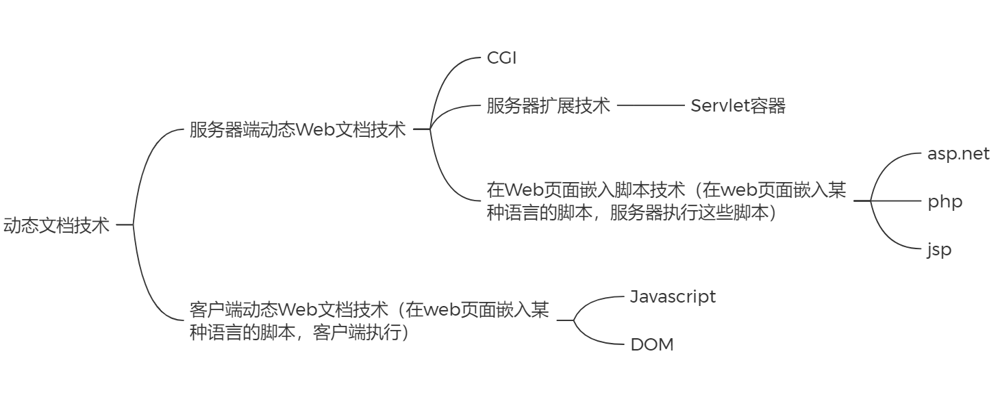

# 1.前端知识导学

### 1.Java Web

​	使用Java语言开发的、动态web资源开发技术统称为Java Web

### 2.软件架构

##### 1.C/S

​	翻译：Client/Server 客户端/服务器端

​	条件：在用户本地有一个客户端程序，在远程有一个服务器端程序

​	例如：QQ，迅雷...

​	优点：用户体验好，所需要的大的文件都在安装时存储在了本地，例如游戏中的地图资源

​	缺点：开发时需要开发客户端和服务器端、使用前需要安装、软件更新时，客户端和服务器同时更新、不能跨平台、C/S的软件客户端和服务器通信时采用的是自由协议，相对来说比较安全、部署维护麻烦

##### 2.B/S

​	翻译：Browser/Server 浏览器/服务器端

​	条件：只需要一个浏览器，用户通过不同的网址(URL)，客户访问不同的服务器端程序

​	本质：B/S本质上是C/S，只不过B/S架构的软件，使用浏览器作为软件的客户端

​	优点：开发时仅需开发服务器端、软件不需要安装，直接使用浏览器访问指定的网址即可、软件更新时，客户端不需要更新、可以跨平台，只要有浏览器就可以使用，所以开发的成本低得多、B/S架构的软件，客户端和服务器之间的通信采用的时通用的HTTP协议，相对来说不安全、部署维护简单

​	缺点：如果应用过大，用户的体验可能会受到影响、对硬件要求过高

### 3.乱码

##### 1.编码

​	依据一定的规则，将字符转换为二进制编码的过程

##### 2.解码

​	依据一定的规则，将二进制编码转换为字符的过程

##### 3.字符集

​	编码和解码所采用的规则，我们称为字符集
​	常见的字符集
​		ASCII
​			美国系统默认编码
​		ISO-8859-1
​		GBK
​		GB2312
​			中文系统默认编码
​		**UTF-8**
​			万国码，支持地球上所有文字
​		ANSI
​			自动编码，根据你所使用的系统自动编码

##### 4.乱码出现的原因

​	在计算机中保存的任何内容，最终都需要转换为0 1这种二进制编码来保存，包括网页中的内容。**而乱码出现的根本原因是：编码和解码采用的字符集不同。**

##### 5.建议做法

​	在中文系统的浏览器中，默认都是使用GB2312进行解码的，所以最好开发国内的网站时，使用GB2312进行编码，浏览器默认使用GB2312解码
​	或者**用meta标签的charset属性设置解码字符集，浏览器就会按照该字符集进行解码**

### 4.Internet提供的服务

​	Internet也称为因特网、互联网，指全球最大的、开放的、由众多网络互联而成的计算机网络。Internet提供的服务主要有WWW、FTP、E-mail、BBS、Telent

##### 1.WWW（也被称为Web）

​	一个完整的WWW系统由四部分组成1.Web服务器（也被称为Web站点），如Tomcat。2.Web客户端（包含浏览器Browser）。3.HTML文件（也被称为Web页面、Web文档、网页）。4.网络（即协议）。
​	静态文档（网页）

​	特点：
​	所有用户访问，得到的结果是一样的。
​	如：文本，图片，音频、视频, HTML,CSS,JavaScript
​	如果用户请求的是静态资源，那么服务器会直接将静态资源发送给浏览器。浏览器中内置了静态资源的解析引擎，可以展示静态资源

动态文档（网页）
	特点：
	所有用户访问，得到的结果可能不一样。
	如：jsp/servlet,php,asp...
	如果用户请求的是动态资源，那么服务器会执行动态资源，转换为静态资源，再发送给浏览器				动态文档技术

	
**WWW运行的三个重要概念：URI、HTTP、HTML**

##### 2.FTP、E-mail、BBS、Telent

​	