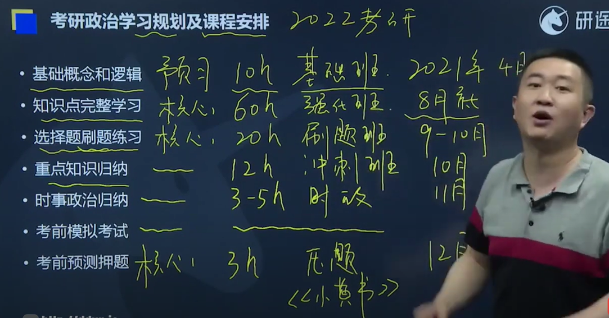

# 一、考研政治前学

工科政治国家线大概在40~45之间

期望分值是70~75

|                   书籍                   | 分值 |
| :--------------------------------------: | ---- |
|          马克思主义基本原理概论          | 24   |
| 毛泽东思想和中国特色社会主义理论体系概论 | 30   |
|              中国近代史纲要              | 14   |
|          思想道德修养和法律基础          | 16   |
|            当代世界政治与经济            | 16   |

|  题型  | 个数 | 分值 |
| :----: | ---- | ---- |
| 单选题 | 16   | 16   |
| 多选题 | 17   | 34   |
| 分析题 | 5    | 50   |

| 难度对比                              | 分值 |
| ------------------------------------- | ---- |
| 送分题（正能量问题）                  | 20   |
| 常识题（硬记忆题目）                  | 20   |
| 归纳题（硬记忆+弱逻辑题）             | 20   |
| 运用题（细节+强逻辑题）               | 20   |
| 丢分题（超强逻辑+站在命题人角度的题） | 20   |

时间安排：

肖四肖八必买！！！

# 二、预习课程

