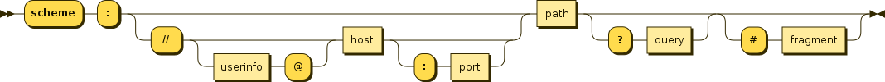
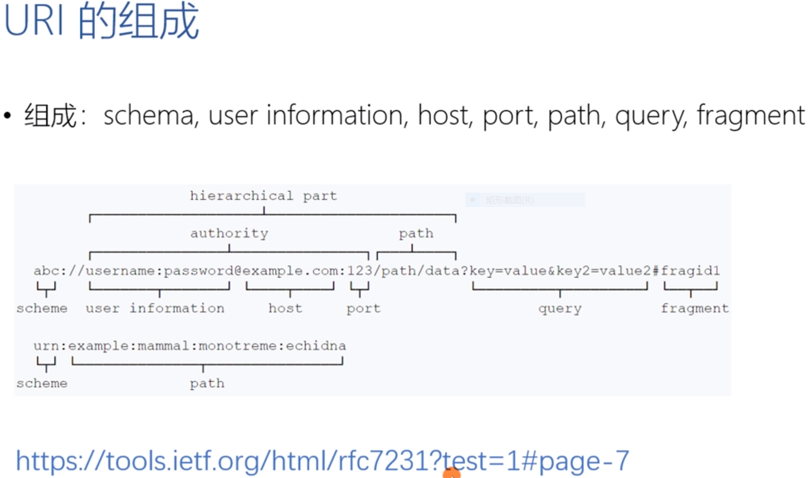

# 1.URL URN URI

### 1.联系

URL和URN都是URI的子集

### 2.定义

**URL**：统一资源定位系统（Uniform Resource Locator）。URL是URI的一种，不仅标识了Web 资源，还指定了操作或者获取方式，同时指出了主要访问机制和网络位置

**URN**：统一资源名（Uniform Resource Name）。URN是URI的一种，用特定命名空间的名字标识资源。使用URN可以在不知道其网络位置及访问方式的情况下讨论资源

**URI**：统一资源标识符（Uniform Resource Identifier）。

​	URI的一般语法：

​		`URI = scheme:[//authority]path[?query][#fragment]`

​		`authority = [userinfo@]host[:port]`

### 3.举例

这是一个URI：

`http://www.myy.com:8080/posts/hello.html?Name=myy&age=21#intro`

​	1.`http`是协议，它定义了访问资源的方式

​	2.`www.myy.com:8080/posts/hello.html`是资源存放的位置

​		`myy.com`是域名

​		`8080`是端口

​		`post/hello.html`是路径

​	3.`#intro`是资源

### 4.知乎回答URL和URI的区别与联系

作者：daixinye
链接：https://www.zhihu.com/question/21950864/answer/154309494
来源：知乎
著作权归作者所有。商业转载请联系作者获得授权，非商业转载请注明出处。

统一资源标志符URI就是在某一规则下能把一个资源独一无二地标识出来。
拿人做例子，假设这个世界上所有人的名字都不能重复，那么名字就是URI的一个实例，通过名字这个字符串就可以标识出唯一的一个人。
现实当中名字当然是会重复的，所以身份证号才是URI，通过身份证号能让我们能且仅能确定一个人。
那统一资源定位符URL是什么呢。也拿人做例子然后跟HTTP的URL做类比，就可以有：

动物住址协议://地球/中国/浙江省/杭州市/西湖区/某大学/14号宿舍楼/525号寝/张三.人

可以看到，这个字符串同样标识出了唯一的一个人，起到了URI的作用，所以URL是URI的子集。URL是以描述人的位置来唯一确定一个人的。
在上文我们用身份证号也可以唯一确定一个人。对于这个在杭州的张三，我们也可以用：

身份证号：[123456789](tel:123456789)

来标识他。
所以不论是用定位的方式还是用编号的方式，我们都可以唯一确定一个人，都是URl的一种实现，而URL就是用定位的方式实现的URI。

回到Web上，假设所有的Html文档都有唯一的编号，记作html:xxxxx，xxxxx是一串数字，即Html文档的身份证号码，这个能唯一标识一个Html文档，那么这个号码就是一个URI。
而URL则通过描述是哪个主机上哪个路径上的文件来唯一确定一个资源，也就是定位的方式来实现的URI。
对于现在网址我更倾向于叫它URL，毕竟它提供了资源的位置信息，如果有一天网址通过号码来标识变成了[http://741236985.html](https://link.zhihu.com/?target=http%3A//741236985.html)，那感觉叫成URI更为合适，不过这样子的话还得想办法找到这个资源咯…